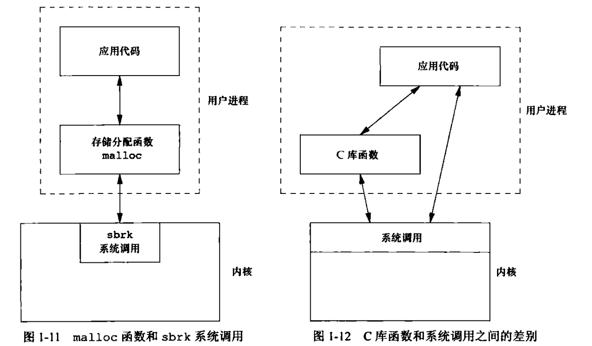

# UNIX基础知识

## UNIX体系结构

UNIX体系结构示例图：


UNIX体系结构中的核心概念：

1. **操作系统**：可以将其定义为一种软件，控制计算机的软硬件资源，提供程序运行的环境，又称之为内核(kernel)
2. **系统调用**：内核提供的接口称为系统调用，系统调用属于底层接口，C语言的库函数是对于系统调用的进一步封装
3. **Shell**：Shell是一个特殊的应用程序，为运行其它程序提供了一个接口，用户可以通过向Shell输入命令使用内核的一些功能

## 登录

初步介绍UNIX系统的密码文件，一般系统密码文件(口令文件)位于`/etc/passwd`，文件中不会存储明文密码

```shell
cat /etc/passwd
```

密码文件格式通常为：`root:x:0:0:root:/root:/bin/bash`

- **root**：表示用户名
- **x**：加密之后的密码，现代Linux系统已经将加密后的密码转移到其它文件，因此这里的'x'没有实际意义
- **0**：用户ID，对于root用户，用户ID为0
- **0**：组ID，对于root用户，组ID为0
- **root**：注释信息
- **/root**：用户的家目录
- **/bin/bash**：用户使用的Shell

## 文件和目录

### 文件属性

常见的文件属性包含

1. 文件类型(普通文件还是目录)

2. 文件权限

3. 文件的所有者

4. 文件的大小

5. 文件最后的修改时间

通过`ls -l`命令可以查看部分文件属性

### 目录

目录是一个包含目录项的文件，目录项的逻辑视图与实际存放在磁盘上的方式不同。UNIX文件系统一般不在目录项中存放属性，主要是因为一个文件具有多个硬链接时，很难保证多个属性副本之间的同步

### stat和fstat函数

stat和fstat函数可以获取文件属性

```c
#include <sys/types.h>
#include <sys/stat.h>
#include <unistd.h>
int stat(const char *pathname, struct stat *statbuf);
int fstat(int fd, struct stat *statbuf);
```

[stat函数与fstat函数的基本使用](./src/stat_fstat.c)

### opendir和readdir函数

opendir打开一个目录，readdir可以读取目录中的每一项(entry)

```c
#include <sys/types.h>
#include <dirent.h>
DIR *opendir(const char *name);
struct dirent *readdir(DIR *dirp);
```

[opendir函数和readdir函数的使用](./src/opendir_readdir.c)

opendir函数内部内部会申请一块内存用于填充DIR结构，然后返回该DIR结构的地址，因此调用opendir函数后需要调用closedir释放申请的内存。readdir根据DIR结构读取目录中的每一项，DIR结构中可能存在一个结构current记录当前正在使用的目录项，current的初始值为第一个目录项，每调用一次readdir，current就进行一次迭代，readdir从current中获取正在访问的目录项属性，当current迭代完毕后，readdir返回NULL

readdir函数的返回值为`struct dirent *`，使用后不需要释放，这个函数内部可能存在一个`static struct dirent entry`，每一次调用向该静态entry中填充值，并返回其地址

### chdir函数

chdir函数用于改变进程的工作目录

```c
#include <unistd.h>
int chdir(const char *path);
```

[chdir的使用](./src/chdir_usage.c)

## 输入和输出

### 标准输入、标准输出和标准错误

每一个进程默认打开3个文件：标准输入(stdin)、标准输出(stdout)和标准错误(stderr)，它们对应的文件描述符为0、1、2，当进程打开一个普通文件后，返回的文件描述符为大于等于3的值。标准输入对应的设备为键盘，标准输出和标准错误对应的设备均为显示器

```c
/* Standard file descriptors.  */
#define	STDIN_FILENO	0	/* Standard input.  */
#define	STDOUT_FILENO	1	/* Standard output.  */
#define	STDERR_FILENO	2	/* Standard error output.  */
```

### 不带缓冲的I/O

函数read、write、lseek、close、open提供了不带缓冲的I/O(unbuffered I/O)，fopen、fclose、fread、fwrite提供的是带缓冲的I/O(buffered I/O)。

不带缓冲的I/O（Unbuffered I/O）指的是数据直接从用户空间传输到内核空间，或者从内核空间传输到用户空间，而不经过任何中间的缓冲区，这意味着每次调用这些函数时，都会立即触发实际的I/O操作。

- **open**: 打开文件或设备，返回一个文件描述符。
- **read**: 从文件描述符读取数据，直接将数据从内核空间复制到用户空间。
- **write**: 将数据写入文件描述符，直接将数据从用户空间复制到内核空间。
- **close**: 关闭文件描述符，释放相关资源。
- **lseek**: 改变文件描述符的读写位置。

带缓冲的I/O（Buffered I/O）会使用一个中间缓冲区来暂存数据。例如，标准C库中的`fopen`、`fread`、`fwrite`等函数就是带缓冲的I/O操作。它们会在用户空间维护一个缓冲区，只有当缓冲区满了或者显式地刷新（如调用`fflush`）时，才会进行实际的I/O操作，将缓冲区的数据从用户空间拷贝到内核空间。

带缓冲的I/O通常能提高性能，因为减少了系统调用的次数。每次系统调用都需要从用户态切换到内核态，这个过程是有开销的。不带缓冲的I/O更适合实时性要求高的场景，因为每次操作都是即时生效的，没有延迟。

[使用unbuffered I/O将标准输入复制到标准输出](./src/unbuffered.c)

[使用buffered I/O将标准输入复制到标准输出](./src/buffered.c)

### 标准I/O

标准I/O函数是系统调用接口的封装，为不带缓冲的I/O函数提供了一个用户缓冲区，例如printf函数，首先将格式化的字符串输出到用户空间的缓冲区，用户空间缓冲区满后，自动调用write函数将数据复制到内核空间

## 程序和进程

程序指的是磁盘上的一个文件，**内核**使用exec函数将程序读入内存并执行。UNIX进程控制有3个主要的函数：`fork`、`exec`系列函数、`waitpid`，使用这3个函数可以构建一个简单的Shell程序

[simple shell](./src/shell.c)

## 出错处理

UNIX系统错误处理主要通过errno完成，POSIX和ISO C中关于errno的定义：

```c
extern int errno;
```

Linux系统多线程环境下对于errno的定义：

```c
extern int* __errno_location(void);
#define errno (*__errno_location())
```

Linux系统多线程环境下将errno定义为一个函数的返回值，多线程环境下，每一个线程都有属于它自己的局部errno，示例[errno_thread.c](./src/errno_thread.c)中子线程打开一个不存在的文件，open函数返回-1，子线程的errno被设置为2，主线程的errno依然是默认值0

### strerror和perror函数

```c
char *strerror(int errnum);
void perror(const char *s);
```

strerror将错误码映射为一条对应的错误消息，perror会根据errno的值向`标准错误`输出指定信息

[strerror与perror的使用](./src/strerror_perror.c)

### 常见非致命性错误

1. `EAGAIN`（`EWOULDBLOCK`）
   - **含义**：这两个错误码在很多情况下是等效的。它们表示资源暂时不可用。比如在进行非阻塞 I/O 操作时，如果没有数据可读或者缓冲区已满无法写入，就会返回这个错误。这是一种提示，表明操作应该稍后重试。
   - **示例**：在网络编程中，当使用非阻塞套接字读取数据时，如果没有数据到达套接字缓冲区，`recv`函数可能会返回`EAGAIN`或`EWOULDBLOCK`。这意味着程序应该等待一段时间后再尝试读取，而不是一直占用 CPU 资源进行无效的读取操作。
2. `ENFILE`
   - **含义**：系统中打开的文件太多。这个限制是针对整个系统而言的，包括文件描述符等资源的耗尽。当达到系统限制的打开文件数量上限时，就会出现这个错误。
   - **示例**：如果一个服务器程序不断地打开新的文件（如日志文件、配置文件等），但没有正确地关闭它们，最终可能会耗尽系统允许的文件打开数量，导致`ENFILE`错误。此时需要检查文件打开和关闭的逻辑，或者调整系统的文件描述符限制。
3. `ENOBUFS`
   - **含义**：没有足够的缓冲区空间。这可能发生在进行网络通信、存储设备读写等操作时，例如网络栈没有足够的缓冲区来接收新的数据，或者磁盘 I/O 系统没有足够的缓冲区来处理写入请求。
   - **示例**：在网络设备驱动程序中，如果接收数据的缓冲区已满，又有新的数据到达，就可能返回`ENOBUFS`错误。这提示需要等待缓冲区有可用空间后再进行数据接收操作，或者调整缓冲区大小。
4. `ENOLCK`
   - **含义**：没有可用的锁。通常在进程间或线程间尝试获取锁资源（如文件锁、互斥锁等）时，如果所有的锁都已经被占用，就会返回这个错误。
   - **示例**：多个进程同时尝试对一个文件进行排他性写操作，并且使用文件锁来控制并发访问。如果锁已经被其他进程占用，新的进程在尝试获取锁时就可能会得到`ENOLCK`错误，此时需要等待锁被释放后再尝试获取。
5. `ENOSPC`
   - **含义**：没有剩余空间。这主要用于文件系统相关的操作，表示存储设备（如硬盘、闪存等）上没有足够的空间来完成操作。例如，当试图写入一个文件，但是文件系统所在的磁盘分区已满时，就会出现这个错误。
   - **示例**：在向一个已经几乎满的硬盘分区中拷贝大文件时，当剩余空间不足以容纳这个文件时，文件写入操作就会返回`ENOSPC`错误。此时需要清理磁盘空间或者将文件存储到其他有足够空间的位置。
6. `ENOMEM`
   - **含义**：没有足够的内存。这是一个比较常见的错误，表示系统无法为请求的操作分配足够的内存。可能是因为程序请求的内存块太大，或者系统本身的内存已经耗尽（由于其他进程占用了大量内存等原因）。
   - **示例**：当一个大型应用程序（如数据库管理系统）试图分配一个非常大的内存区域来缓存数据，但系统的物理内存和虚拟内存都已经几乎耗尽时，`malloc`等内存分配函数可能会返回`ENOMEM`错误。这就需要优化内存使用，或者增加系统内存。
7. `EBUSY`
   - **含义**：资源忙。通常表示设备或者其他资源正在被使用，无法进行请求的操作。例如，试图卸载一个正在被其他进程访问的文件系统时，就可能返回`EBUSY`错误。
   - **示例**：如果一个可移动存储设备（如 USB 闪存盘）上的文件正在被某个程序读取或写入，当尝试格式化这个设备时，就可能会因为设备忙而返回`EBUSY`错误。需要先停止对该设备的其他访问操作，然后再进行格式化等操作。
8. `EINTR`
   - **含义**：系统调用被中断。当一个系统调用（如`read`、`write`等）在执行过程中被一个信号中断时，就会返回这个错误。这是一种机制，允许信号处理程序在系统调用执行期间打断它。
   - **示例**：一个程序正在进行长时间的文件读取操作（`read`系统调用），此时如果收到一个信号（如`SIGINT`，用户按下`Ctrl + C`），`read`系统调用可能会返回`EINTR`错误。程序可以根据需要决定是重新开始系统调用还是进行其他处理（如清理资源并退出）。

## 用户标识

### 用户ID与组ID

一个用户拥有一个唯一的标识，称为用户ID，一个用户可以属于多个组，每一个组有一个ID称为组ID。存放组ID与组名的文件是`/etc/group`，其中组ID为0表示root。存放用户ID与组ID对应关系的文件是`/etc/passwd`，对于root而言，用户ID和组ID均为0

### getuid与getgid函数

```c
#include <unistd.h>
#include <sys/types.h>
uid_t getuid(void);
gid_t getgid(void);
```

用于获取用户ID与组ID

[getuid和getgid函数使用示例](./src/id.c)

### 附属组ID(supplementary group ID)

一个用户拥有1个用户ID，但是它可以同时属于多个组，因此有附属组ID的概念，即一个用户ID可以对应多个组ID

## 信号

### 中断键与退出键

按下中断键(interrupt key)与退出键(quit key)可以产生信号，终止程序。按下中断键(Ctrl + C)会产生一个SIGINT信号，按下退出键(Ctrl + `\`)会产生一个SIGQUIT信号

### signal函数

使用signal函数可以对信号进行捕获，进程收到信号后，会调用注册的信号处理函数

```c
#include <signal.h>
typedef void (*sighandler_t)(int);
sighandler_t signal(int signum, sighandler_t handler);
```

[shell程序(带信号处理)](./src/signal_use.c)

## 时间值

### 日历时间

日历时间指的是从1970-01-01 00:00:00到现在所经过的秒数，系统中使用`time_t`类型表示，可以通过time函数获得日历时间

[使用time获取日历时间](./src/time_use.c)

### CPU时间

CPU时间用`clock_t`表示，使用time命令可以查看进程的CPU时间：

```
time ./a.out
./a.out  0.02s user 0.16s system 27% cpu 0.651 total
```

`0.02s user`表示用户CPU时间为0.02s，`0.16s system`表示系统CPU时间为0.16s，`27% cpu`表示该程序运行期间占用的 CPU 资源比例为 27%，`0.651 total`表示整个程序运行总耗时0.651秒。

系统CPU时间：进程执行内核程序所花费的CPU时间

用户CPU时间：进程执行用户程序所花费的CPU时间

## 系统调用与库函数

**系统调用**：系统调用是程序进入内核的入口点，通过`man 2`可以查看系统调用接口

```bash
man 2 fork
man 2 write
```

**库函数**：库函数不是内核的入口点，部分库函数是系统调用的封装，例如printf是系统调用write的封装，但并非所有的库函数都封装了系统调用接口。例如atoi。一般与I/O、文件、内存相关的C语言库函数都会调用系统接口，单纯实现应用算法的接口不会调用库函数，例如strcpy和qsort，它们是纯粹的用户态函数

**malloc**：malloc是最典型的库函数，malloc会调用系统接口sbrk，sbrk不是一个通用的内存管理器，sbrk按照指定字节数增加或减少进程地址空间，如何管理进程地址空间取决于进程，如果用户不喜欢malloc管理进程地址空间的方式，可以自己实现malloc(不过一般不这样做，因为malloc默认的内存管理算法已经足够优秀)。内核中的系统调用负责分配一块空间给进程，malloc则在用户层管理内核分配的空间

系统调用与库函数图示：

