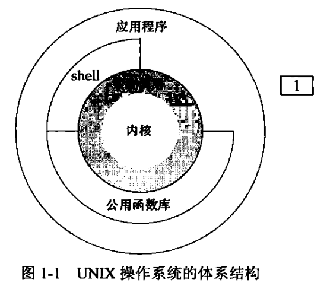

# UNIX基础知识

## UNIX体系结构

UNIX体系结构示例图：



UNIX体系结构中的核心概念：

1. **操作系统**：可以将其定义为一种软件，控制计算机的软硬件资源，提供程序运行的环境，又称之为内核(kernel)
2. **系统调用**：内核提供的接口称为系统调用，系统调用属于底层接口，C语言的库函数是对于系统调用的进一步封装
3. **Shell**：Shell是一个特殊的应用程序，为运行其它程序提供了一个接口，用户可以通过向Shell输入命令使用内核的一些功能

## 登录

初步介绍UNIX系统的密码文件，一般系统密码文件(口令文件)位于**/etc/passwd**，文件中不会存储明文密码

```shell
cat /etc/passwd
```

密码文件格式通常为：`root:x:0:0:root:/root:/bin/bash`

- **root**：表示用户名
- **x**：加密之后的密码，现代Linux系统已经将加密后的密码转移到其它文件，因此这里的'x'没有实际意义
- **0**：用户ID，对于root用户，用户ID为0
- **0**：组ID，对于root用户，组ID为0
- **root**：注释信息
- **/root**：用户的家目录
- **/bin/bash**：用户使用的Shell

## 文件和目录

### 文件属性

常见的文件属性包含

1. 文件类型(普通文件还是目录)

2. 文件权限

3. 文件的所有者

4. 文件的大小

5. 文件最后的修改时间

通过`ls -l`命令可以查看部分文件属性

```sh
ll README.md                                                                              
-rwxrwxr-x+ 1 sdt51209 domainusers 1.5K Oct 31 10:55 README.md
```

### 目录

目录是一个包含目录项的文件，目录项的逻辑视图与实际存放在磁盘上的方式不同。UNIX文件系统一般不在目录项中存放属性，主要是因为一个文件具有多个硬链接时，很难保证多个属性副本之间的同步

### stat和fstat函数

stat和fstat函数可以获取文件属性

```c
#include <sys/types.h>
#include <sys/stat.h>
#include <unistd.h>
int stat(const char *pathname, struct stat *statbuf);
int fstat(int fd, struct stat *statbuf);
```

[stat函数与fstat函数的基本使用](./src/stat_fstat.c)

