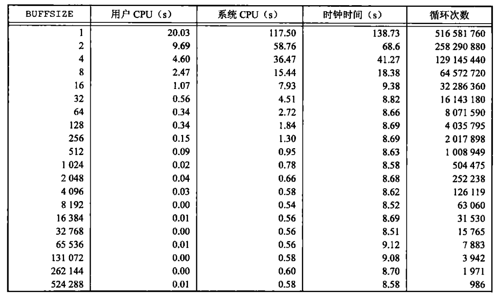

# 文件I/O

## 引言

UNIX系统文件I/O主要关注下列问题：

1. 可用的文件I/O函数：open、read、write、lseek、close等
2. unbuffered I/O的概念和理解
3. 多进程文件共享
4. dup、fcntl、sync、fsync、ioctl等函数的用法

## 文件描述符

对于内核而言，所有打开的文件都通过文件描述符引用。文件描述符是一个非负整数，当打开一个文件或者创建一个新文件时，操作系统内核向进程返回一个文件描述符，读写文件时，将open或creat返回的文件描述符作为参数传递给read或write。

UNIX系统下，每一个进程默认打开3个文件描述符，分别是0、1、2，对应标准输入、标准输出和标准错误，在头文件`<unistd.h>`中分别用`STDIN_FILENO`、`STDOUT_FILENO`和`STDERR_FILENO`表示：[打印默认文件描述符](./src/default_fd.c)

> 文件描述符的最大值

文件描述符的最大值决定了进程能够打开的文件的最大数量，有多种方式可以查看文件描述符的最大值

```bash
ulimit -n # 表示当前会话允许打开的文件描述符的最大数量
cat /proc/sys/fs/file-max # 整个UNIX系统允许打开的文件描述符的最大数量
sysctl fs.file-max # 系统允许打开的文件描述符的最大数量
cat /proc/${process_id}/limits | grep "Max open files" # 查看指定进程文件描述符的最大值
```

[打印进程文件描述符的最大值](./src/max_fd.c)

## open和openat函数

调用open或openat函数可以打开或**创建**一个文件

```c
#include <sys/types.h>
#include <sys/stat.h>
#include <fcntl.h>
int open(const char *pathname, int flags);
int open(const char *pathname, int flags, mode_t mode);
int openat(int dirfd, const char *pathname, int flags);
int openat(int dirfd, const char *pathname, int flags, mode_t mode);
```

open函数的参数`mode_t mode`仅当创建新文件时才发挥作用，此参数用来指定创建的新文件的权限，pathname参数是要打开或者创建文件的名称，flags参数用来表示函数调用的选项，使用`|`运算符可以指定多个选项

### flags参数

flags参数的常用选项：

- `O_RDONLY`：以只读方式打开文件
- `O_WRONLY`：以只写方式打开文件
- `O_RDWR`：以读、写方式打开文件

使用open打开或创建文件时，这3个选项只能指定一个且必须指定一个，除此之外，有一些其它可选选项：

```c
/* open/fcntl.  */
#define O_ACCMODE	   0003
#define O_RDONLY	     00
#define O_WRONLY	     01
#define O_RDWR		     02
#ifndef O_CREAT
# define O_CREAT	   0100	/* Not fcntl.  */
#endif
#ifndef O_EXCL
# define O_EXCL		   0200	/* Not fcntl.  */
#endif
#ifndef O_NOCTTY
# define O_NOCTTY	   0400	/* Not fcntl.  */
#endif
#ifndef O_TRUNC
# define O_TRUNC	  01000	/* Not fcntl.  */
#endif
#ifndef O_APPEND
# define O_APPEND	  02000
#endif
#ifndef O_NONBLOCK
# define O_NONBLOCK	  04000
#endif
#ifndef O_NDELAY
# define O_NDELAY	O_NONBLOCK
#endif
#ifndef O_SYNC
# define O_SYNC	       04010000
#endif
#define O_FSYNC		O_SYNC
#ifndef O_ASYNC
# define O_ASYNC	 020000
#endif
#ifndef __O_LARGEFILE
# define __O_LARGEFILE	0100000
#endif

#ifndef __O_DIRECTORY
# define __O_DIRECTORY	0200000
#endif
#ifndef __O_NOFOLLOW
# define __O_NOFOLLOW	0400000
#endif
#ifndef __O_CLOEXEC
# define __O_CLOEXEC   02000000
#endif
#ifndef __O_DIRECT
# define __O_DIRECT	 040000
#endif
#ifndef __O_NOATIME
# define __O_NOATIME   01000000
#endif
#ifndef __O_PATH
# define __O_PATH     010000000
#endif
#ifndef __O_DSYNC
# define __O_DSYNC	 010000
#endif
#ifndef __O_TMPFILE
# define __O_TMPFILE   (020000000 | __O_DIRECTORY)
#endif
```

- `O_APPEND`：以写的方式打开文件时，每次写入都在文件末尾追加写入

- `O_CREAT`：打开文件时，若文件不存在则创建，使用此选项时一般需要说明参数mode，表示需要创建的文件对应的权限

- `O_EXCL`：一般与`O_CREAT`选项配合使用，若flags参数中同时包含`O_EXCL|O_CREAT`，那么在打开文件时文件不存在会创建文件并且open函数成功返回，若文件存在则出错返回。如果单独使用`O_CREAT`，文件存在时不会新建文件，而是直接返回(不出错)。`O_EXCL|O_CREAT`配合使用时如果成功返回表示之前文件一定不存在且此次调用一定新建了文件。`O_EXCL`使测试文件和创建文件成为一个**原子操作**

  [O_EXCL|O_CREAT判断文件是否存在](./src/O_EXCL_test.c)

- `O_NOCTTY`：此选项仅当参数path为终端设备时生效，如果pathname是一个终端设备，使用`O_NOCTTY`表示不将该设备分配作为进程的控制终端

- `__O_NOFOLLOW`：此选项可以检查pathname是否是一个符号链接，如果是，则open函数出错返回

  [__O_NOFOLLOW检查符号链接](./src/__O_NOFOLLOW_test.c)

- `O_NONBLOCK`：设置文件的I/O操作为非阻塞模式

- `O_NDELAY`：设置I/O操作的模式为不延迟，与`O_NONBLOCK`的区别是`O_NONBLOCK`在没有数据可读时，将errno设置为`EAGAIN`或`EWOULDBLOCK`并返回-1，而`O_NDELAY`在没有数据可读时返回0，这与已经读到文件末尾的返回值0冲突，`O_NDELAY`具有二义性

- `O_SYNC`：使每一次write操作等待物理I/O操作完成，包括由该write操作引起的文件属性更新所需的I/O

- `O_TRUNC`：如果文件存在，并且以`O_WRONLY`或`O_RDWR`方式打开，则将文件长度截断为0，即清空文件

### 文件描述符的分配规则

open或openat函数返回的文件描述符是最小且未使用的描述符数值，利用这一特点，可以重定向标准输入、标准输出和标准错误。例如，一个应用程序可以先关闭标准输出(1号文件描述符)，然后使用open打开一个文件，返回的文件描述符即为1，完成了将标准输出重定向到文件的功能

[标准输出重定向](./src/STDOUT_FILENO_redirect.c)

### openat函数

openat函数基本功能与open函数类似

```c
int openat(int dirfd, const char *pathname, int flags, mode_t mode);
```

- 当参数pathname为绝对路径时，dirfd参数被忽略，此时openat函数功能与open函数完全一样

- 当参数pathname为相对路径时，dirfd用来指明是"相对于哪一个目录"，当dirfd为`AT_FDCWD`时，表示相对于当前目录，dirfd为其它值时，表示相对于"指定目录"

  [openat函数使用](./src/openat_usage.c)

openat函数主要解决的问题：让线程可以使用相对路径名打开目录中的文件，而不是只能打开当前工作目录。同一个进程中的多个线程共享当前工作目录，比较难让同一个进程中的不同线程同一时间工作在不同的工作目录

> TOCTTOU(Time Of Check To Time Of Use)

TOCTTOU（Time Of Check To Time Of Use）是一种常见的计算机安全漏洞，特别是在文件系统操作中。它指的是在检查某个条件和实际使用该条件之间存在时间差，这段时间内系统状态可能会发生变化，从而导致安全问题。

[TOCTTOU示例](./src/TOCTTOU.c)

## creat函数

```c
#include <sys/types.h>
#include <sys/stat.h>
#include <fcntl.h>
int creat(const char *pathname, mode_t mode);
```

creat函数等价于`open(pathname,O_WRONLY|O_CREAT|O_TRUNC,mode)`，creat函数的主要是为了弥补早期open函数的不足，早期UNIX系统下open函数不能打开一个不存在的文件，open函数也不能创建文件，不过后来open函数增加了`O_CREAT`选项，creat函数也就较少使用了，此外，creat函数创建文件是以只写方式打开的，灵活性不强

[creat函数示例](./src/creat_use.c)

## close函数

```c
#include <unistd.h>
int close(int fd);
```

close函数用于关闭一个打开的文件，关闭一个文件时还会释放进程加在这个文件上的所有锁，当进程终止时，系统内核会自动关闭所有它打开的文件

## lseek函数

每一个打开的文件都有一个与其相关的"当前文件偏移量(current file offset)"，通常是一个非负整数，对文件的读写操作都是从当前文件偏移量位置开始，进行读写时，偏移量也会随之变化。默认情况下，打开一个文件，偏移量被设置为0，如果指定了`O_APPEND`选项，则直接偏移到文件末尾，lseek函数可以显式的调整偏移量

```c
#include <sys/types.h>
#include <unistd.h>
off_t lseek(int fd, off_t offset, int whence);
```

参数offset与参数whence：

- 若whence为`SEEK_SET`，表示将文件的偏移量设置为距文件开始处offset个字节
- 若whence为`SEEK_CUR`，表示将文件偏移量设置为当前值加offset，offset可以为负数
- 若whence为`SEEK_END`，表示将文件偏移量设置为文件长度加offset，offset可正可负

lseek执行成功会返回新的文件偏移量。对于一些特殊文件，无法使用lseek设置偏移量，例如管道、FIFO和网络套接字，如果尝试使用lseek对这些文件设置偏移量，lseek会返回-1，并将errno设置为ESPIPE

[lseek使用示例](./src/lseek_use.c)

lseek仅将当前的文件偏移量记录在内核中，它不引起任何的I/O操作。文件偏移量可以大于文件的长度，在这种情况下，对该文件的下一次写入操作将加长该文件，并在文件中构成"空洞"，若尝试对"空洞"进行读取，则其值为0

[演示"文件空洞"](./src/empty_hole_example.c)

## read函数

read函数用于从打开的文件中读取数据，读取成功返回读到的字节数，如果读到文件末尾返回0，读取失败返回-1，并且设置errno

```c
#include <unistd.h>
ssize_t read(int fd, void *buf, size_t count);
```

[演示read函数不同的返回值](./src/test_read.c)

read函数使用时的注意事项：

- read函数的最后一个参数是期望读取到的字节数count，返回值是实际读取到的字节数realcount，realcount<=count，read函数会将内核空间的数据拷贝到用户空间，并且不会添加`\0`，用户如果想要以C语言的形式解释字符串，需要手动添加`\0`。read函数在读取到文件末尾时，会返回0
- read函数从终端设备读取数据时，通常一次最多读取一行，并且会将回车键(`'\n'`)也进行读取，参考[read函数示例](./src/test_read.c)
- read函数从网络中读取数据时，由于缓冲机制可能造成返回值小于所需要读取的字节数
- read函数从管道或FIFO读取数据时，若管道包含的字节数小于所需的数量，read将返回实际可用的字节数
- read函数正在进行读取数据时可能会被信号中断
- read函数的读操作是从当前文件偏移量位置开始，在成功返回之前，偏移量将增加实际读到的字节数

## write函数

write函数用于向文件中写入数据

```c
#include <unistd.h>
ssize_t write(int fd, const void *buf, size_t count);
```

write函数的返回值通常与参数count相同，否则表示出错，write函数常见的一个出错原因是磁盘已经写满。对于普通文件，写操作从文件当前偏移量处开始，如果在打开该文件时指定了`O_APPEND`选项，那么在每一次写操作之前，会将文件偏移量设置在文件当前结尾位置，写操作成功之后，文件偏移量增加实际写入的字节数

[write函数示例](./src/write_usage.c)

## I/O的效率

程序[testIO](./src/test_io.c)利用read和write函数，从标准输入读取数据，并将其输出到标准输出，该程序中不同BUFFER_SIZE(缓冲区)对I/O的效率影响较大，假设运行该程序时将标准输入重定向到一个大小为516581760字节的文件，将标准输出重定向到`/dev/null`，下面是在不同缓冲区下程序运行所花费的时间表：



可以看出系统CPU时间的最小值差不多出现在缓冲区大小为4096附近，这里只需要知道，缓冲区的大小会影响IO的效率，程序实际进行IO时，最好将将缓冲区的大小设置为磁盘块的大小(一般是4096)，这样可以较大程度提高IO的效率。可以使用命令`stat -f /`查看磁盘块的大小

## 文件共享


